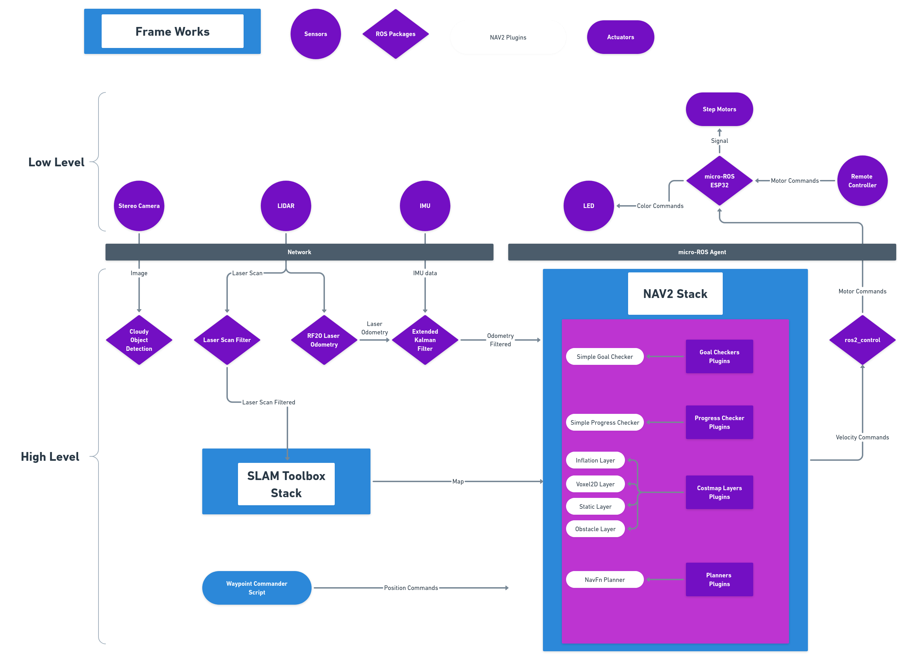
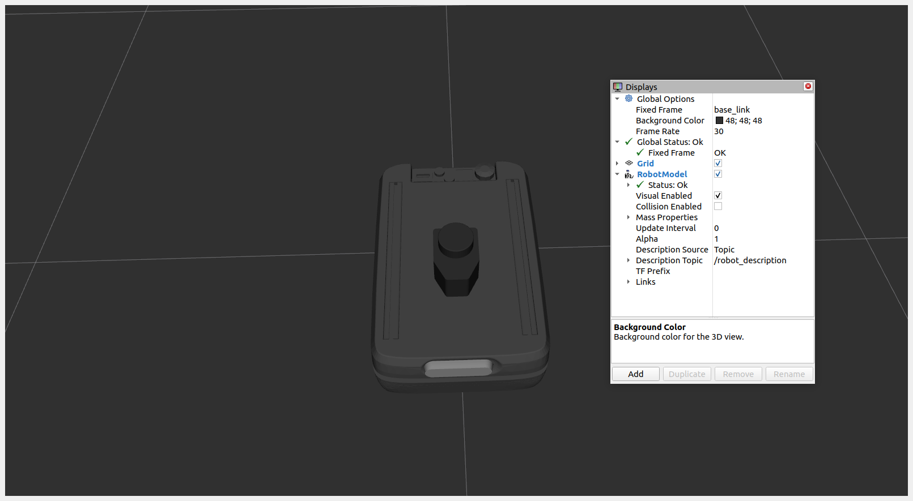

#  
# robolaunch Cloudy Documentation

<p>
Welcome to the documentation of robolaunch Cloudy.
</p>

<iframe  height=600 width=900 src="https://www.youtube.com/embed/7wn2tVbTrz8" title="YouTube video player" frameborder="0" allow="accelerometer; autoplay; clipboard-write; encrypted-media; gyroscope; picture-in-picture; web-share" allowfullscreen></iframe>


# Home


<p align="center">

</p>


Cloudy is an open-source, 3D-printed robot designed and built by Robolaunch. Whether you're a seasoned DIY enthusiast, robotics professional or just getting started in the world of robotics, Cloudy has something to offer for you. 


- Powered by robolaunch platform:
    - Transfer your sensor data into cloud, process sensor data real-time in heavy AI applications using the best GPUs available and reflect the results to the robot!
    - Gazebo/Rviz/Isaac Sim(optional)/MuJoCo simulation over cloud VDI for virtual development purposes. 
    - Access Cloudy development environment with a cloud IDE in just minutes and start developing your algorithms on a cloud VDI.
    - Utilize NVIDIA powered Isaac ROS packages on cloud GPUs and run AI applications on Cloudy!
    - 5G Robot control remotely.(If available) 
- State of the art autonomous navigation stack (ROS2 Nav2).
    - Waypoint follower
    - Obstacle avoidance
    - Flexible algorithm selection and various plugins based on different use cases.
- Simultaneous localization and mapping(SLAM) using LIDAR, IMU and motor encoders.
- Flexible and modifiable ros2_control algorithm. 
- Powered by micro-ROS, start developing your embedded software on ESP32 
and connect them into ROS environment! 

- Light enough to be carried in a backpack! (~3 kg)
- Strong enough to lift 20 kg payload!


<button name="button" onclick="window.open('https://github.com/robolaunch/cloudy','_blank')">Go to Github</button>

[Manufacturing Guide](MechanicalManifacturing/MechanicalManifacturing)

------------------------------------------------------------------------------

# Hardware Guide
## Specifications
Cloudy uses the esp32 micro controller on the embedded hardware side.

Cloudy robot has a Hardware Stack containing the main electronics and computer, all the parts here are cooled by a powerful fan. The Hardware Stack is easily separated from the body of the cloudy, which allows you to easily replace them and use them outside of the robot.<br/>

  <figcaption>Esp32 Wemos D1 Uno</figcaption>
<br/>
The first layer of the Hardware Stack contains an esp32 microcontroller. This board is known as uno esp32 and is compatible with most arduino uno shields.<br/><br/><br/>

  
<figcaption>CNC Shield - Monster Moto Shield</figcaption><br/>
The second layer contains shield for the motor drivers. Depending on your motor type (step, dc, brushless) you can choose different shield to the compatible driver board.this layer ensures the stable operation of the motor drivers.<br/><br/><br/>


  <figcaption>Raspberry Pi 4 - Orange Pi 5 - Jetson Nano</figcaption><br/>
On the top layer, there is a single board computer. Cloudy supports raspberry pi, orange pi 5, jetson nano computers. You can easily access the USBs on it and use add-ons such as stereo camera and lidar.
<br/>
<br/>
Cloudy is a robot equipped with sensors. These sensors work with i2c protocol and are deployed with i2c multiplexer so you can connect multiple same sensors.Cloudy includes 3 distance sensors, 2 for collision avoidance in the bumper, and 1 for protection from falling from a height. In addition, there are neopixel LEDs on all four sides, these LEDs are used for robot visibility and status indication. You can learn the battery voltage and status with the tiny oled screen at the top.
<br/>
<br/><br/>
<br/><br/>
<br/>

| **Attribute**            | **Description** |
|--------------------------|-----------------|
| Weight                   | ~2.7 kg         |
| Chassis material         | PLA(Default)    |
| Maximum linear velocity  |                 |
| Maximum angular velocity |                 |
| Maximum payload          |                 |
| Battery life             |                 |
| Wi-Fi range&throughput   |                 |
| RC Control Range         |     ~ 300m      |

## Block Diagram

A block diagram of robolaunch Cloudy components and connections between them.</br>

<p align="center">

</p>

## Wiring Diagram

The detailed wiring diagram is below. If you want to improve or modify this diagram, you can download the fritzing application file <a href="#">here</a> and modify it.

<p align="center">

</p>

## Installation Guide

## Box Installation


# Software Guide

Welcome to Software Guide of Cloudy. In this guide we will look at the software requirements, components and how to use them. All the software is available on the [Github repository](https://github.com/robolaunch/cloudy). Feel free to contribute!

## Requirements

Cloudy is tested on the systems below:

| Operating System    | ROS2 version |
|---------------------|--------------|
| Ubuntu 22.04(arm64) | Humble       |
| Ubuntu 22.04(amd64) | Humble       |


## High-Level Architecture
Here is a high level architecture diagram of the Cloudy software. You can access and modify the block diagram from the [link](https://whimsical.com/LxtNBwNDTjNXYP3EHM6uqS)! 
<p align="center">

</p>

## Detailed Architecture

Here is a detailed architecture diagram of the Cloudy software. You can access and modify the detailed diagram from the [link](https://raw.githubusercontent.com/robolaunch/cloudy/main/docs/DetailedSoftwareDiagram.drawio)! 
<p align="center">

</p>

## Components

In this section software components of the Cloudy will be explained. We will start from the Low Level components in the diagram then move to High Level components. 

### micro-ROS

micro-ROS bridges the gap between resource-constrained microcontrollers and larger processors in robotic applications that are based on the Robot Operating System(ROS). micro-ROS source code can be found at [link](https://github.com/micro-ROS). We are using ESP32 with precompiled micro-ROS library, in addition to that to receive signals from controller we are using an [IBus library](https://github.com/bmellink/IBusBM), to control motors [step motor library](https://github.com/gin66/FastAccelStepper) and to configure leds a [led library](https://github.com/adafruit/Adafruit_NeoPixel). Since micro-ROS enables the seamless integration with ROS2, we can control motors and configure leds using ROS2 topics published from computer! 

You can check the firmware code from [Github repository](https://github.com/robolaunch/cloudy/blob/main/robolaunch_cloudy_hardware/firmware/firmware_flysky.ino).

- Note that the remote controlling is optional. You can still drive your robot using teleoperation from ROS2. The teleoperation is explained in [Teleoperating Cloudy](?id=teleoperation)

Here is a table of topics consumed by ESP32 microcontroller

| **Topic**          | **Type**          | **Description**                                      |
|--------------------|-------------------|------------------------------------------------------|
| /left_motor_speed  | std::Msg::Float32 | Desired left motor speed in radians                  |
| /right_motor_speed | std::Msg::Float32 | Desired right motor speed in radians                 |
| /neopixel_led      | std::Msg::Int8    | 1-headlight 2-emergency 3-left_signal 4-right_signal |


### Teleoperation
There are 3 core packages for teleoperating Cloudy: [robolaunch_cloudy_description](https://github.com/robolaunch/cloudy/tree/main/robolaunch_cloudy_description), [robolaunch_cloudy_bringup](https://github.com/robolaunch/cloudy/tree/main/robolaunch_cloudy_bringup) and [robolaunch_cloudy_hardware](https://github.com/robolaunch/cloudy/tree/main/robolaunch_cloudy_hardware). We will examine those packages step by step.
#### robolaunch_cloudy_description
 The first package is [robolaunch_cloudy_description](https://github.com/robolaunch/cloudy/tree/main/robolaunch_cloudy_description) which is includes URDF files describing Cloudy and sensors. Other packages uses [robolaunch_cloudy_description](https://github.com/robolaunch/cloudy/tree/main/robolaunch_cloudy_description) package to define a physical robot instance. 


| **Topic**          | **Type**          | **Description**                                      |
|--------------------|-------------------|------------------------------------------------------|
| /robot_description  | std::Msg::String | Robot descriptions in XML format                     |

Let's check the descriptions:
```bash
ros2 launch robolaunch_cloudy_description description.launch.py
```


Now the [robolaunch_cloudy_description](https://github.com/robolaunch/cloudy/tree/main/robolaunch_cloudy_description) package publishes robot descriptions to the ROS2 network. We can visualize the robot description using RViz.

<p align="center">

</p>

#### robolaunch_cloudy_bringup

The second package is [robolaunch_cloudy_bringup](https://github.com/robolaunch/cloudy/tree/main/robolaunch_cloudy_bringup) which defines the [ros2_control](https://control.ros.org/master/index.html) parameters and spawns controllers&state publishers(using [robolaunch_cloudy_description](https://github.com/robolaunch/cloudy/tree/main/robolaunch_cloudy_description) package). Controller nodes subscribes to /cmd_vel topic. To control the robot we have to publish `Twist` type message to  `/cmd_vel` topic. Configurations related to control can be adjusted from the `/config/diffbot_diff_drive_controller.yaml` file. 

| **Topic**          | **Type**          | **Description**                                      |
|--------------------|-------------------|------------------------------------------------------|
| /cmd_vel  | geometry::Msg::Twist | Velocity command in radians per second                     |

#### robolaunch_cloudy_hardware

The [robolaunch_cloudy_hardware](https://github.com/robolaunch/cloudy/tree/main/robolaunch_cloudy_hardware) package creates a hardware interface to communicate with actuators. By design choice we decide to perform control calculations with ros2_control on Single Board Computer. Then the desired velocities gets forward to ESP32 over `left_motor_speed` and `right_motor_speed` topics. To remember topic descriptions refer to [micro-ROS](?id=micro-ros) section.

#### Controlling robot

To control the robot we have to launch [robolaunch_cloudy_bringup](https://github.com/robolaunch/cloudy/tree/main/robolaunch_cloudy_bringup) node.

```bash
ros2 launch robolaunch_cloudy_bringup diffbot_system.launch.py
```

Now Cloudy is alive! Let's move it by opening a new terminal:

```bash
ros2 run teleop_twist_keyboard teleop_twist_keyboard
```
<p align="center">

</p>

### SLAM and Navigation

**Vehicle Types**
- cloudy_v2 (default)
- cloudy_v1
- arcelik

#### Simulation

The launch files for simulation are collected under `sim_launch` folder. All config files are under `config` folder and the ones starting with `sim_` are used for simulation.

First source the workspace
```bash
source install/setup.bash
```
In order to launch both SLAM and navigation run:
```bash
ros2 launch robolaunch_cloudy_navigation sim_launch_all.launch.py
```

To launch with other robolaunch robots set the `vehicle` launch argument to one of the vehicle types given above. Openning `arcelik` vehicle might take a few minutes since it has detailed parts.
```bash
ros2 launch robolaunch_cloudy_navigation sim_launch_all.launch.py vehicle:="'arcelik'"
```

If you want to launch saperately, first open the simulation. The default vehicle is `cloudy_v2` but if you wish to use another robot, set the `vehicle` parameter to one of the vehicles listed above. Default map is warehouse but if you wish to open on playground world use `world:=playground`.
```bash
ros2 launch robolaunch_cloudy_simulator gazebo.launch.py
```

Then launch slam:
```bash
ros2 launch robolaunch_cloudy_navigation sim_slam.launch.py
```

Finally, launch navigation. If you would like to open rviz set rviz parameter true by adding `rviz:=true` at the end of the command:
```bash
ros2 launch robolaunch_cloudy_navigation sim_nav.launch.py
```

#### Physical

##### Cloudy

Connect to the robot via ssh and launch the sensor nodes: (password: robolaunch)

```bash
ssh ubuntu@172.16.44.219
```
Launch `rplidar` and check the scan data:

```bash
ros2 launch rplidar_ros rplidar.launch.py
```

```bash
ros2 topic echo /scan
```
If there is no data on the topic, change the serial port of the lidar. First see the available ports:

```bash
ls /dev/ | grep USB
```

Then change the port with `'serial_port': '/dev/ttyUSB0'` parameter.

```bash
sudo nano /opt/ros/humble/share/rplidar_ros/launch/rplidar.launch.py
```
After the change source the ros distro once again.

```bash
source /opt/ros/humble/setup.bash
```

Launch IMU:

```bash
cd ~/imu && \
. install/setup.bash && \
ros2 launch mpu6050driver mpu6050driver_launch.py
```

Launch micro ROS agent with the other port and push the little silver button on top of the robot:

```bash
ros2 run micro_ros_agent micro_ros_agent serial --dev /dev/ttyUSB1
```

Follow the instructions below in a remote computer which is connected to the same network as the robot. They would all work also in robots computer; however, since the nodes that are going to be run are computationally havy, this would not work optimally. **Do not give ROS_DOMAIN_ID** the low level controller will not work if it is given.

The launch files used for physical world are under `launch` folder. The config files that do not start with `_sim` are for physical world. Since Arcelik robot has different sensor set and since it uses different low level controller it has saperate launch files. The files starting with `arcelik_` are for Arcelik robot only. The files starting with `cloudy_` can be used both with `cloudy_v2` and `cloudy_v1` by setting the parameter `vehicle:="'<vehicle name>'"`, if the parameter is not set the default vehicle is `cloudy_v2`. 

First source the workspace:

```bash
source install/setup.bash
```

Launch `SLAM` for desired vehicle. If Arcelik vehicle is being used, lauch `arcelik_slam.launch.py`. If cloudy_v1 or cloudy_v2 is being used, launch `cloudy_slam.launch.py`. They launch the proper nodes for lidar sensor, laser odometry, ekstended kalman filter for sensor fusion, low level controller enabling `cmd_vel` topic, and laser filter to prevent lidar from seing the robot as obstacle. To launch SLAM with rviz set rviz parameter true by `rviz:=true`.

```bash
ros2 launch robolaunch_cloudy_navigation cloudy_slam.launch.py
```

Then in a new terminal launch `nav2` for autonomous navigation. This file only launches bringup for nav2 using the proper config file.
```bash
source install/setup.bash \
ros2 launch robolaunch_cloudy_navigation cloudy_nav.launch.py
```

#### Configuration

All config files are under `config` folder. There are five types of config files which are ekstended kalman filter, slam, navigation, laser filter, and mask filter.

---

#### EKF

<pre>
- arcelik_ekf.yaml : contains parameters for arcelik vehicle.
- sim_ekf.yaml     : contains parameters for simulation.
- ekf.yaml         : contains parameters for cloudy.
</pre>

| Parameter              |      Explanation            | 
|------------------------|:---------------------------|
| frequency              |  The frequency, in Hz, at which the filter  will output a position estimate.                       |
| two_d_mode (true/flase)|    ignores 3D information   |
| publish_tf (true/flase)| Publishes odom transform    |
| map_frame              | name of the map frame       |
| odom_frame             | name of the odom frame      |
| base_link_frame        | name of the base_link frame |
| world_frame            | name of the world frame     |


Give name to your sensor parameter and define what sensor datas are needed to be fused with EKF.

data_name: topic_name

data_name_config: 2D array of bool determinning wether or not to fuse sensor data like described below. Fusing datas which are derivative of each other is not recomended, see <a href="https://navigation.ros.org/setup_guides/odom/setup_odom.html">nav2 documentation</a> for detailed information. 

|       X         |        Y        |        Z       | 
|-----------------|-----------------|----------------|
| x position      |  y position     |  z position    |
| roll position   |  pitch position |  yaw position  |
| x velocity      |  y velocity     |  z velocity    |
| roll velocity   |  pitch velocity |  yaw velocity  |
| x acceleration  |  y acceleration |  z acceleration|

---

#### Laser Filter

<pre>
- box_filter.yaml   : filters laser range data in a rectangle.
- range_filter.yaml : filters laser range outside a given interval.
</pre>

**Box Filter**

| Parameter |      Explanation                       | 
|-----------|:---------------------------------------|
| type      | laser_filters/LaserScanBoxFilter       |
| name      | name of the filter                     |
| box_frame | frame name                             |
| max_x     | front of the rectangle                 |
| max_y     | left side of the rectangle             |
| max_z     | top of the rectangle                   |
| min_x     | (negative) back of the rectangle       |
| min_y     | (negative) right side of the rectangle |
| min_z     | (negative) bottom of the rectangle     |


**Range Filter**

| Parameter                |      Explanation                           | 
|--------------------------|:-------------------------------------------|
| name:                    | name of the filter                         |
| type:                    | laser_filters/LaserScanRangeFilter         |
| lower_threshold          | ignores shorter laser ranges (in meters)   |
| upper_threshold          | ignores longer laser ranges (in meters)    |
| lower_replacement_value  | (.inf / -.inf) replacement for short ranges|
| upper_replacement_value  | (.inf / -.inf) replacement for long ranges |

---

#### SLAM

<pre>
- sim_slam.yaml: parameters for SLAM in simulation.
- sim_slam.yaml: parameters for SLAM in physical world.
</pre>

Important `SLAM Toolbox` parameters. See <a href="https://github.com/SteveMacenski/slam_toolbox">slam toolbox github</a> for more detailed information.

| Parameter                |      Explanation                           | 
|--------------------------|:-------------------------------------------|
| scan_topic               | name of the laser scan topic
| mode                     | (mapping/localization) set to localization if no addition to map will be made|
| map_file_name            | map file path without file extension        |
| map_start_pose           | starting position with respect to map origin|
| map_start_at_dock        | (true/false) start at the pose where you started mapping.|
| debug_logging            | (true/false) set to false while not debugging to prevent abundant logs |
| map_update_interval      | period of map updating in second            |
| max_laser_range          | max laser range to be considered in mapping and localization|

---

#### Keepout Filter

<pre>
- map_filter.yaml: parameters for navigation with keepout zones
</pre>

If there are restricted areas on the map that the robot should not enter, keepout zones should be used. Parameters to be set are explained in the tabel below. See <a href="https://navigation.ros.org/tutorials/docs/navigation2_with_keepout_filter.html">nav2 documentation</a> for more detailed explanation.

| Parameter |      Explanation                       | 
|-----------|:---------------------------------------|
| type      | for Keepout Filter the type of costmap filter should be set to 0|
| name      | name of the filter                     |
| box_frame |    frame name                          |
| max_x     | front of the rectangle                 |
| max_y     | left side of the rectangle             |
| max_z     | top of the rectangle                   |
| min_x     | (negative) back of the rectangle       |
| min_y     | (negative) right side of the rectangle |
| min_z     | (negative) bottom of the rectangle     |

---

#### Navigation

<pre>
- sim_navigation.yaml: parameters for navigation in simulation.
- navigation.yaml    : parameters for navigation in physical world.
</pre>

- For behaviour threes see <a href="https://navigation.ros.org/behavior_trees/index.html">nav2 documentation</a>

**AMCL**

| Parameter       |      Explanation                       | 
|-----------------|:---------------------------------------|
| robot_model_type| (holonomic / differential-drive / legged / ackermann) `holonomic`: can go every direction, `differential-drive`: turns with speed difference in wheels, `ackerman`: car-like|
| scan_topic      | name of the laser scan topic           |

**Controller Server**

| Parameter                    |      Explanation                         | 
|------------------------------|:-----------------------------------------|
| controller_frequency:        |frequency of the control loop in Hz       |
| min_x_velocity_threshold:    |min velocity in x direction (front +)     |
| min_y_velocity_threshold     |min velocity in y direction (left +)      |
| min_theta_velocity_threshold |min angular velocity (counter clockwise +)|
| failure_tolerance            |amount of toleratable error in meters     |
| progress_checker_plugin      | <a href="https://navigation.ros.org/plugins/index.html#progress-checkers">progress checker plugin list</a> |
| goal_checker_plugins         |<a href="https://navigation.ros.org/plugins/index.html#goal-checkers">goal checker plugin list</a> |
| controller_plugins           |<a href="https://navigation.ros.org/plugins/index.html#controllers">controller plugin list</a> |

**General Goal Checker**

| Parameter          |      Explanation                                     | 
|--------------------|:-----------------------------------------------------|
| plugin:            |<a href="https://navigation.ros.org/plugins/index.html#goal-checkers">goal checker plugin list</a>|
| xy_goal_tolerance: |error in meters on xy plane to check the goal reached |
| yaw_goal_tolerance |error in radian on yaw angle to check the goal reached|

**Follow Path**

| Parameter      |      Explanation                 | 
|----------------|:---------------------------------|
| min_vel_x      |min velocity in x direction       |
| min_vel_y      |min velocity in y direction       |
| max_vel_x      |max velocity in x direction       |
| max_vel_y      |max velocity in y direction       |
| max_vel_theta  |max velocity in yaw angle         |
| min_speed_xy   |min velocity in xy plane          |
| max_speed_xy   |max velocity in xy plane          |
| min_speed_theta|min velocity in yaw angle         |
| acc_lim_x      |acceleration limit in x direction |
| acc_lim_y      |acceleration limit in y direction |
| acc_lim_theta  |decceleration limit in yaw angle  |
| decel_lim_x    |decceleration limit in x direction|
| decel_lim_y    |decceleration limit in y direction|
| decel_lim_theta|decceleration limit in yaw angle  |

**Costmap**

| Parameter|      Explanation                               | 
|----------|:-----------------------------------------------|
| plugin   |<a href="https://navigation.ros.org/plugins/index.html#costmap-layers">costmap layer plugin list</a>          |
| filters  |`keepout_filter` if map mask is going to be used|


**Keepout Filter**

| Parameter         |      Explanation                       | 
|-------------------|:---------------------------------------|
| plugin:           |`nav2_costmap_2d::KeepoutFilter`        |
| enabled           |(true / false)                          |
| filter_info_topic |topic name for map filter info          |

**Inflation Layer**

| Parameter        |      Explanation                       | 
|------------------|:---------------------------------------|
| plugin:          |<a href="https://navigation.ros.org/plugins/index.html#progress-checkers">costmap layer plugin list</a> |
| inflation_radius |distance in meters to avoid obstacles   |

**Voxel2D Layer**

| Parameter |      Explanation                       | 
|-----------|:---------------------------------------|
| plugin    |<a href="https://navigation.ros.org/plugins/index.html#progress-checkers">costmap layer plugin list</a>|
| enabled   |(true / false)                          |

**Planner Server**

| Parameter                     |      Explanation                       | 
|-------------------------------|:---------------------------------------|
| expected_planner_frequency    |planning frequency in Hz|
| use_final_approach_orientation|(true / false) goal poses have orientation data, to ignore orientation set to true|
| allow_unknown                 |(true / false) allows making road plans from unknown reagions of the map|
| use_astar                     |(true / false) defaul shortest path algorithm is dijkstar, to use A* set to true|
| plugin                        |<a href="https://navigation.ros.org/plugins/index.html#planners">planner plugin list</a> |

If the desired path is always linear straigh line planner can be used with following parameters; however it is experimental. It does not avoid collision and it is not stable. To use it checkout to the experimental branch.

<pre>
planner_server:
  ros__parameters:
    plugins: ["GridBased"]
    use_sim_time: True
    GridBased:
      plugin: nav2_straightline_planner/StraightLine
      interpolation_resolution: 0.1
      current_goal_checker: "nav2_controller::SimpleGoalChecker"
</pre>

## Troubleshooting

## Community
- [Website](https://www.robolaunch.io/)
- [LinkedIn](https://www.linkedin.com/company/robolaunch)
- [Twitter](https://twitter.com/robolaunch)
- [Slack]() - *soon*
- [Discord]() - *soon*
- [robolaunch Forum]() - *soon*

## Contributing

Please see [this guide](./CONTRIBUTING.md) if you want to contribute.

