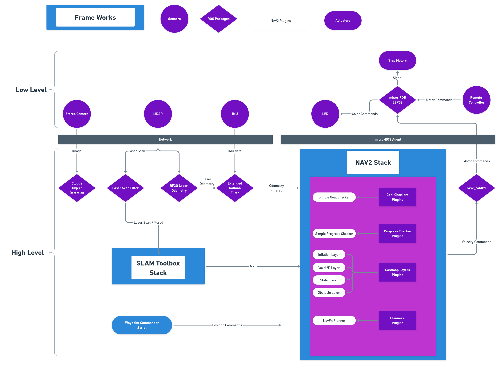
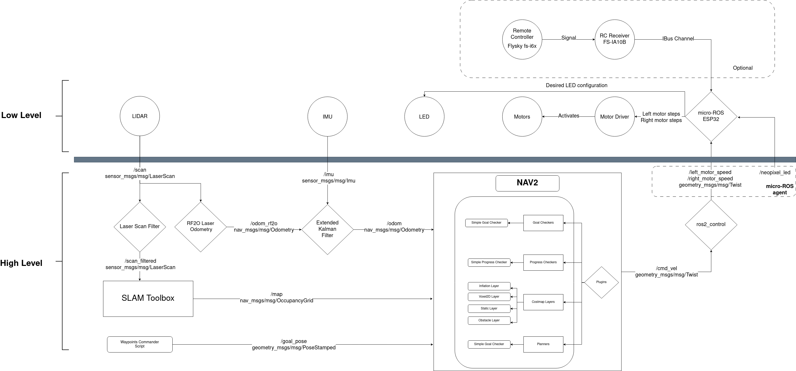

## Software

* **Embedded Software:** 
Cloudy AGV uses a microcontroller for motor driving, sensors and electronics supply. It transmits the data it receives and needs to send to the computer with the micro-ros protocol.

* **SBC (Single Board Computer) Software**
Cloudy AGV robot is a ros2 robot and it needs a simple computer. When the computer power is insufficient, you can limit your robot's power by connecting it to the robolaunch cloud platform.
* **Simulation**
You don't need to have one of them to use Cloudy AGV. You can perform operations such as teleoperation, slam, nav, waypoint follower via gazebo and rviz2.

## Software Architecture

#### High level
Here is a high level architecture diagram of the Cloudy software. You can access and modify the block diagram from the [link](https://whimsical.com/LxtNBwNDTjNXYP3EHM6uqS)! 

#### Low level
Here is a detailed architecture diagram of the Cloudy software. You can access and modify the detailed diagram from the [link](https://raw.githubusercontent.com/robolaunch/cloudy/main/docs/DetailedSoftwareDiagram.drawio)! 

